# Визуальный тур по платформе

> Презентация для команды фонда — как пользоваться платформой по экранам.
> Без флоу ребаланса и финансовой теории. Только «эта кнопка делает X».

---

## 1. Как сюда попасть

Открой <https://trading-chart-mvp.onrender.com>.

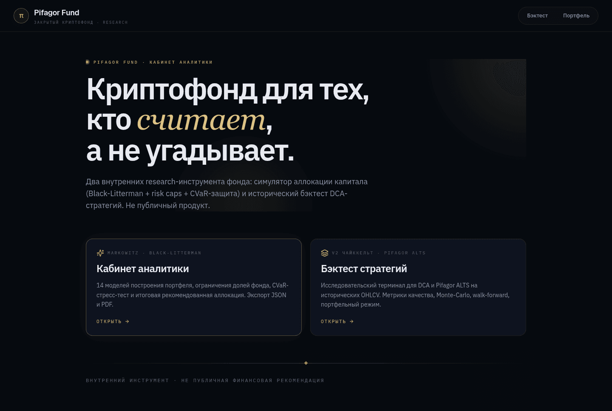

В правом верхнем углу две кнопки:
- **Бэктест** — другая часть платформы, для тестирования торговых стратегий (не нужно сейчас)
- **Портфель** ← кликни сюда

---

## 2. Шапка управления

После клика «Портфель» сверху появится панель управления:

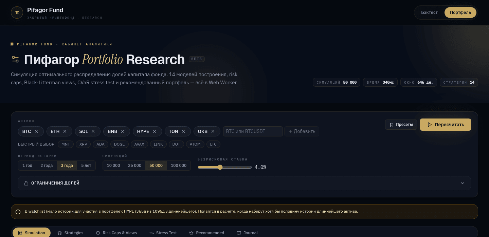

В ней четыре блока:

### 2.1 Активы

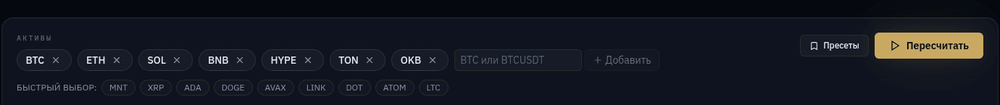

- **Цветные чипы** (`BTC`, `ETH`, …) — это твой текущий universe
- **× рядом с чипом** — убрать актив
- **Поле «BTC или BTCUSDT»** — добавить новый ассет вручную
- **Кнопка «+ Добавить»** — подтвердить ввод
- **«Быстрый выбор»** — одобренные ассеты, которые ещё не в universe (просто кликни чтобы добавить)

### 2.2 Период истории

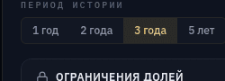

Кнопки `1 год / 2 года / 3 года / 5 лет` — на каком окне обучать модели.

**Default**: 2 года. Это компромисс между длинной историей и включением HYPE (он торгуется ~17 мес).

### 2.3 Симуляций

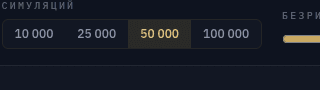

`10 000 / 25 000 / 50 000 / 100 000` — количество Monte-Carlo точек для Simulation tab. Больше = точнее, но медленнее.

**Default**: 50 000.

### 2.4 Безрисковая ставка

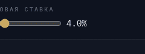

Слайдер 0-10%. Используется в формуле Sharpe ratio.

**Default**: 4.0%.

### 2.5 Ограничения долей

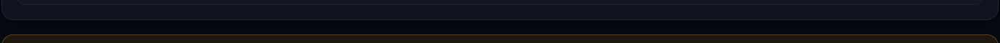

Сворачиваемая секция. Здесь min/max веса для **Monte-Carlo симуляции** (не путать с Risk Caps).

Обычно не трогают.

### 2.6 Кнопка «Пересчитать»

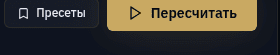

Главная кнопка. После нажатия:

1. Платформа тянет котировки с бирж (~5-15 сек)
2. Считает 14 моделей параллельно в фоне
3. Обновляет все 6 вкладок

Также есть кнопка **«Пресеты»** — сохранить текущую конфигурацию или загрузить ранее сохранённую.

---

## 3. Шесть вкладок

После «Пересчитать» становятся доступны:

| Иконка | Вкладка | За что отвечает |
|---|---|---|
| 📊 | **Simulation** | Пространство возможностей — все возможные портфели |
| 🧱 | **Strategies** | 14 моделей построения портфеля |
| 🛡 | **Risk Caps & Views** | Правила игры — ограничения на веса |
| 📉 | **Stress Test** | Что будет в плохой день |
| 👑 | **Recommended** | Финальный портфель фонда |
| 📔 | **Journal** | История всех расчётов |

---

## 4. Вкладка Simulation

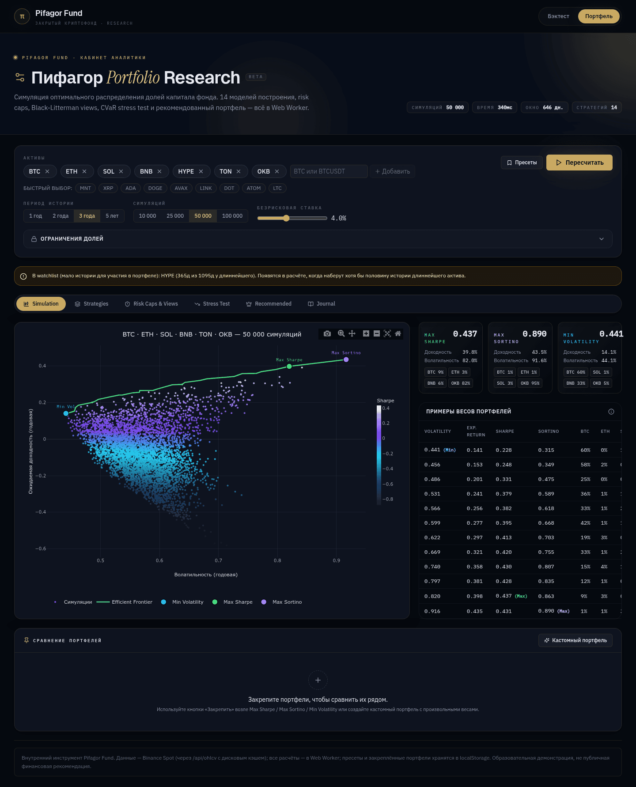

### Что показывает

50 000 случайных портфелей на графике. Каждая точка — одна композиция.

| Что видишь | Что значит |
|---|---|
| **Ось X** (горизонталь) | Волатильность — насколько портфель скачет |
| **Ось Y** (вертикаль) | Доходность за год |
| **Цвет точки** | Sharpe — синий низкий, фиолетовый высокий |
| **Зелёная кривая** | Efficient Frontier — лучшие портфели для каждого уровня риска |

### Три «звёздные» точки на графике

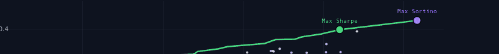

- 🔵 **Min Volatility** — самый «спокойный» портфель
- 🟢 **Max Sharpe** — лучший по соотношению доходности и риска
- 🟣 **Max Sortino** — то же, но «не наказывает за рост»

### Карточки справа

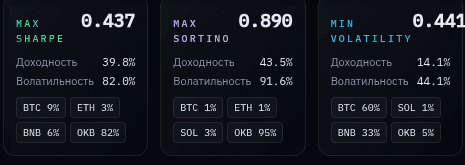

Три карточки с подробной раскладкой:
- Sharpe / Sortino / минимальная Vol
- Реализованные доходность и волатильность
- Распределение по тикерам

### Таблица «Примеры весов портфелей»

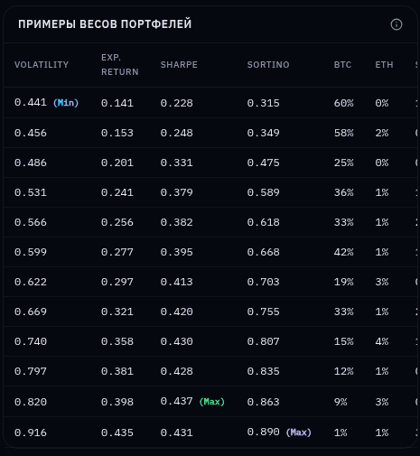

Несколько «образцовых» точек с разной волатильностью. Колонки:
- `Volatility` — риск
- `Exp. Return` — ожидаемая доходность
- `Sharpe` / `Sortino` — risk-adjusted метрики
- Веса BTC / ETH / и т.д.

---

## 5. Вкладка Strategies

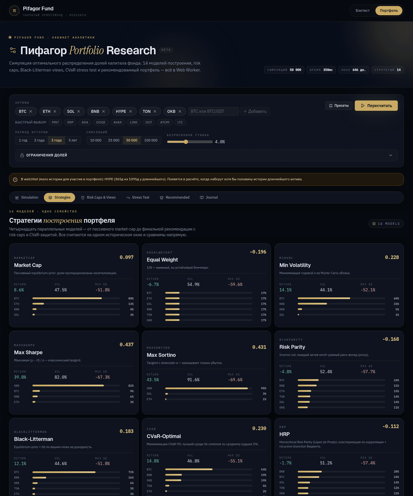

Здесь 14 параллельных моделей построения портфеля.

### 5.1 Карточки моделей

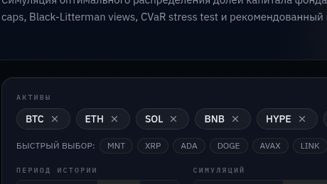

Каждая карточка содержит:

- **Название модели** (например, `Max Sharpe`) и ID в углу
- **Главная метрика** справа сверху (Sharpe ratio для Max Sharpe, σ для Min Vol, и т.д.)
- **Короткое описание** под названием
- **Три полоски снизу**:
  - `Return` — годовая доходность
  - `Vol` — годовая волатильность
  - `Max DD` — максимальная просадка
- **Раскладка по активам** — все веса ≥ 1%, отсортированные по убыванию

### 5.2 Что значат 14 моделей — одна фраза каждая

| Модель | Идея |
|---|---|
| **Market Cap** | По капитализации (пассивный индекс) |
| **Equal Weight** | Поровну — наивный, но устойчивый |
| **Min Volatility** | Минимум скачков любой ценой |
| **Max Sharpe** | Лучшее «доходность / риск» |
| **Max Sortino** | То же, но штрафует только просадки |
| **Risk Parity** | Каждый актив несёт равный риск |
| **Black-Litterman** | Рынок + твои views |
| **CVaR-Optimal** | Защита от худших дней |
| **HRP** | Кластеризация по корреляции (робастная) |
| **Max Diversification** | Максимум разнообразия |
| **Momentum** | Веса по 200-дневному трендy |
| **Fractional Kelly** | Long-term growth, осторожный |
| **Resampled Markowitz** | Усреднение по симуляциям (Michaud) |
| **Final Fund Portfolio** | **Твой реальный фонд** (с применёнными caps) |

### 5.3 Сравнительная таблица

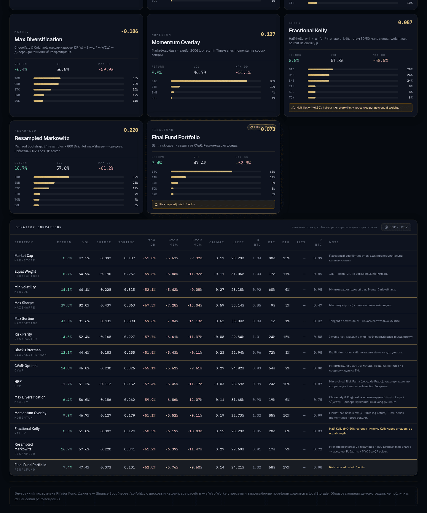

Под карточками — широкая таблица **Strategy Comparison** со всеми метриками:

| Колонка | Что |
|---|---|
| `RETURN` | Годовая доходность (зелёная = +, красная = −) |
| `VOL` | Годовая волатильность |
| `SHARPE` | Sharpe ratio |
| `SORTINO` | Sortino ratio |
| `MAX DD` | Худшая просадка |
| `CVAR 95%` | Средняя потеря в худшие 5% дней |
| `CVAR 99%` | Средняя потеря в худший 1% дней |
| `CALMAR` | Доходность / просадка |
| `ULCER` | Глубина + длительность боли |
| `B-BTC` | Beta к BTC — насколько чувствительна корзина к BTC |
| `BTC / ETH / ALTS` | Состав |
| `P-BTC` | Корреляция с BTC |
| `NOTE` | Описание / алёрты |

**Кнопка `Copy CSV`** в правом верхнем — выгрузка таблицы в Excel.

**Клик на строку** — выбрать стратегию для Stress Test.

---

## 6. Вкладка Risk Caps & Views

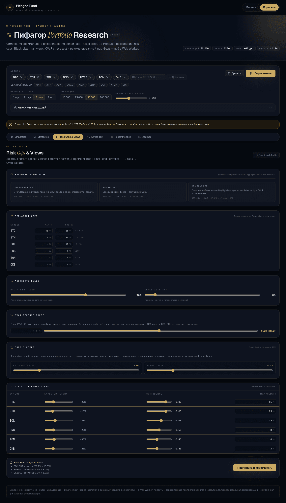

Здесь живут **правила игры** — лимиты, которые накладываются на финальный портфель.

### 6.1 Recommendation Mode

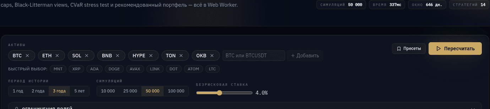

Три preset'а:

| Mode | BTC ≤ | CVaR порог | Core ≥ |
|---|---|---|---|
| **Conservative** | 70% | −6.0% | 75% |
| **Balanced** ← default | 65% | −8.0% | 65% |
| **Aggressive** | 55% | −10.0% | 55% |

Один клик — все настройки ниже перезаписываются под выбранный профиль.

### 6.2 Per-Asset Caps

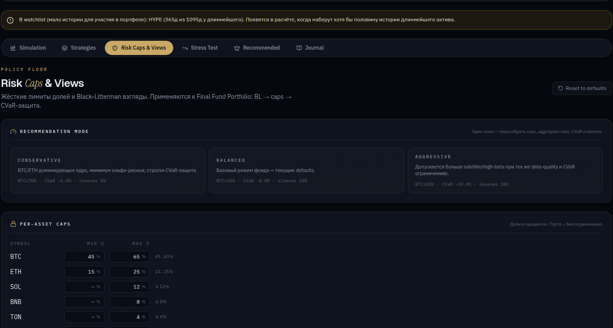

Таблица min/max по каждому активу:

- **Min %** — сколько минимум должно быть в портфеле (можно пусто = 0%)
- **Max %** — сколько максимум разрешено

Пример: HYPE «— / 5%» = «может быть от 0% до 5%». Это страховка от того, чтобы Max Sharpe не поставил туда 73%.

### 6.3 Aggregate Rules

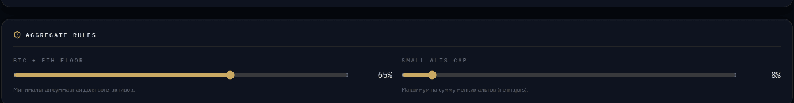

Два слайдера для **групповых правил**:

- **BTC + ETH Floor: 70%** — сумма ядра не может быть меньше
- **Small Alts Cap: 10%** — сумма всех мелких альтов не больше

### 6.4 CVaR-Defense порог

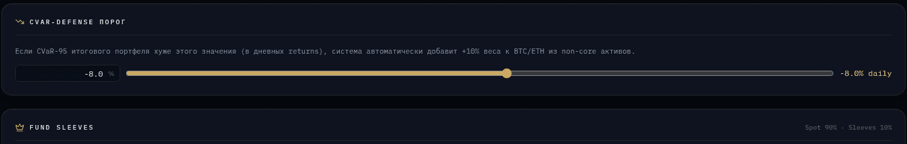

Слайдер от 0% до −15%. Если финальный портфель оказывается хуже этого порога по CVaR-95, **система автоматически добавит +10% веса в BTC/ETH** из альтов.

**Default**: −8.0% дневной.

### 6.5 Black-Litterman Views

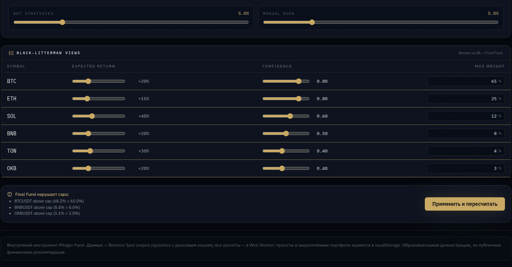

Ниже на странице (если прокрутить) — твои **субъективные ожидания** по активам. Поля:

- `Symbol` — тикер
- `Expected return` — какую годовую доходность ждёшь (например, 20%)
- `Confidence` — насколько ты уверен (0-100%)
- `Max weight` — твой собственный hard limit

Чем выше confidence — тем сильнее engine учтёт твой view.

### 6.6 Reset to defaults

Кнопка в правом верхнем — сбросить всё к Balanced.

---

## 7. Вкладка Stress Test

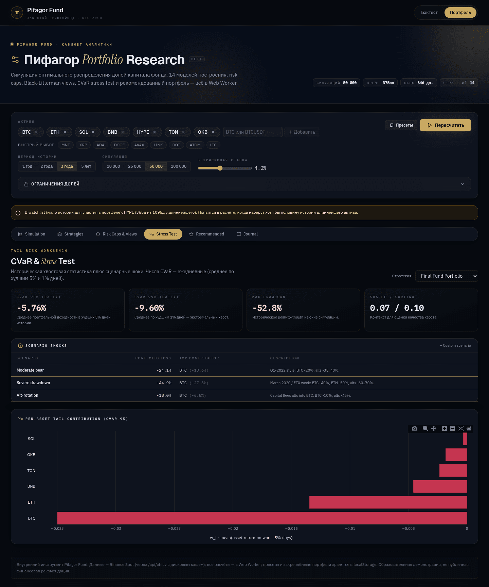

### 7.1 Выбор стратегии

Dropdown наверху — выбери, какую стратегию тестировать. По умолчанию — Final Fund.

### 7.2 Карточки исторической статистики

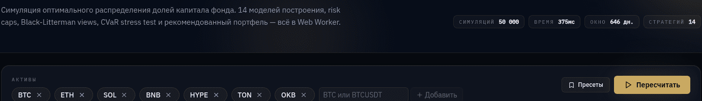

Четыре числа:

- **CVaR-95** — средняя потеря в худшие 5% дней
- **CVaR-99** — средняя потеря в худший 1%
- **Worst day** — самая большая дневная просадка за бэктест
- **Max DD** — пиковая историческая просадка

### 7.3 Сценарии шоков

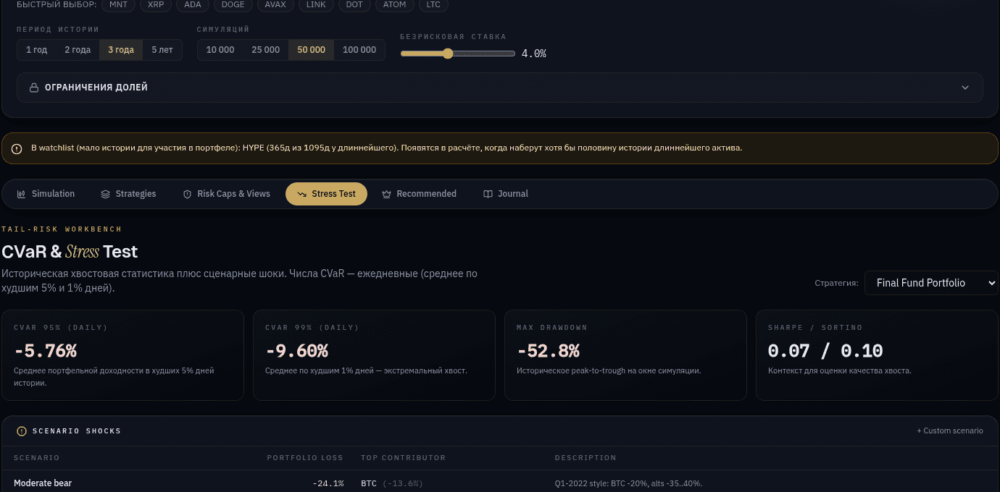

Три «сценария-storyboard»:

| Сценарий | Описание |
|---|---|
| **Moderate bear** | Q1-2022: BTC −20%, альты −35..40% |
| **Severe drawdown** | Март 2020 / FTX: BTC −40%, альты −60..70% |
| **Idiosyncratic shock** | Один-два актива −50% (Терра, USDC) |
| **Custom** | Задаёшь сам |

Для каждого считается потеря фонда + кто внёс самый большой вклад.

### 7.4 Бар-чарт «Tail-risk contribution»

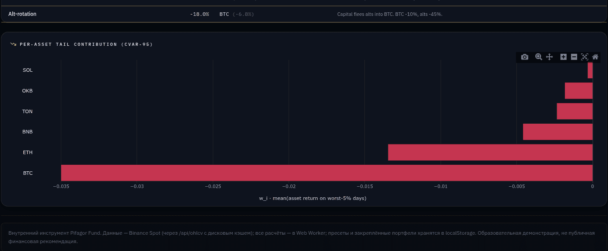

Разложение CVaR-95 по активам — кто исторически больше всех «болит» в плохие дни.

---

## 8. Вкладка Recommended — финальный портфель

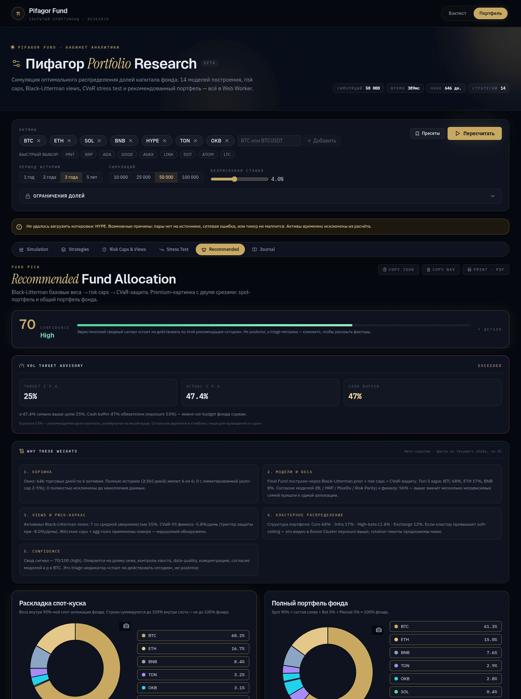

**Центральная вкладка платформы**. Здесь живёт твой **Final Fund Portfolio** и всё, что нужно для принятия решения.

### 8.1 Кнопки в шапке справа

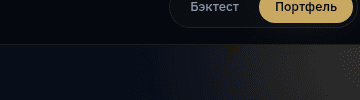

Три кнопки:

- **Copy JSON** — полный snapshot расчёта (для отладки)
- **Copy NAV** ← **главная** — JSON для админки Криптофонда
- **Print** — PDF cover-page

### 8.2 Confidence badge

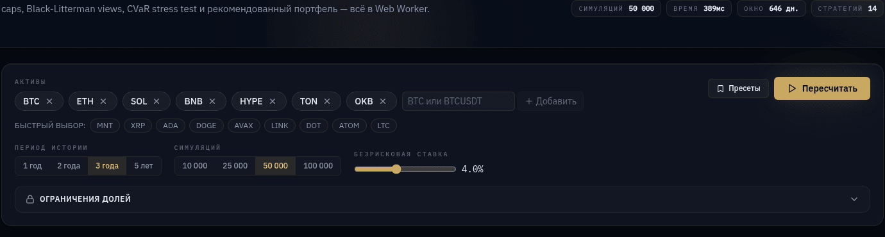

Триаж от 0% до 100%:

- 🟢 **High** (≥ 70) — публиковать можно
- 🟡 **Medium** (40-70) — внимательно проверь
- 🔴 **Low** (< 40) — **не публиковать без ревью**

Под бейджем — разбор по 8 факторам: data quality, model agreement, liquidity, momentum, и т.д.

### 8.3 Why narrative

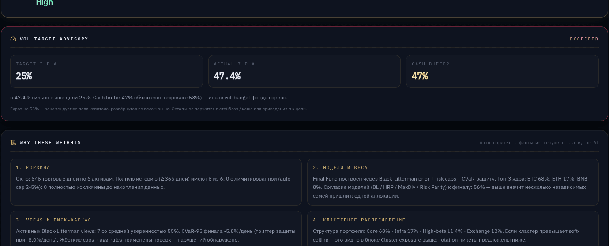

5 параграфов **обычным языком**, почему такая раскладка. Можно копировать в отчёт инвесторам.

### 8.4 Donut «Портфель фонда»

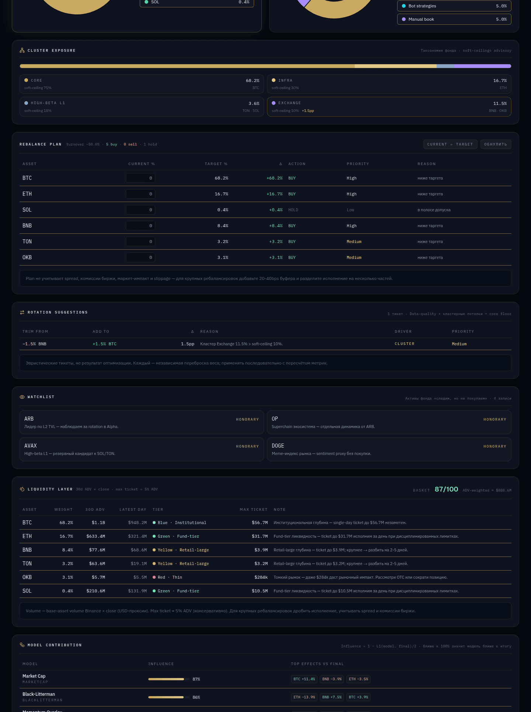

Веса криптоактивов фонда. Фонд **100% spot** (боты и ручная торговля
свёрнуты, июнь 2026) — строки суммируются до **100% фонда**.

Пример: «BTC 71.3% фонда».

### 8.5 Cluster Exposure

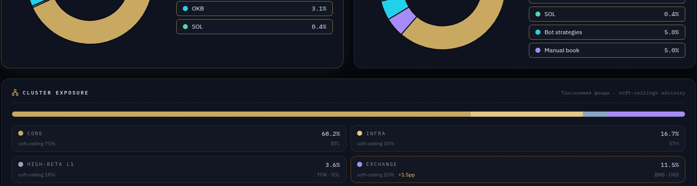

Распределение по 7 кластерам (Core, Infra, High-beta L1, Exchange, Alpha, Meme, Other). Каждый кластер имеет «soft ceiling».

Цветовая полоска показывает превышение / соответствие.

### 8.6 Δ vs Live Fund

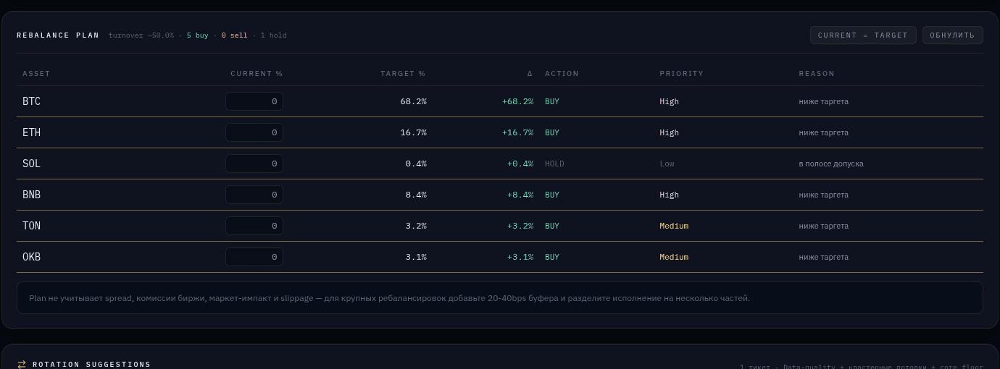

Таблица **target (что engine рекомендует) vs live (что в фонде сейчас)**:

| Symbol | Target | Live | Δ | Action |
|---|---|---|---|---|
| BTC | 67% | 65% | +2pp | 🟢 BUY |
| ETH | 18% | 20% | −2pp | 🔴 SELL |
| SOL | 8% | 8.1% | −0.1pp | ⚪ HOLD |

Две кнопки:
- **Import current** — автозаполнить Rebalance Plan живыми весами фонда
- **Refresh** — обновить с фонда

### 8.7 Rebalance Plan

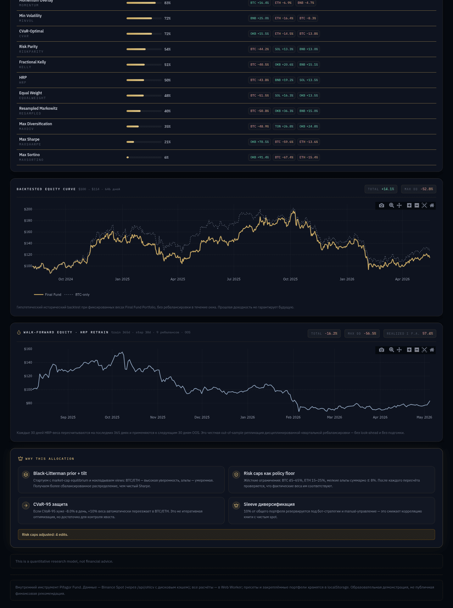

Конкретный план сделок:

- Заводишь **текущие веса** (или импортируешь из Δ vs Live Fund)
- Engine считает delta vs target
- Каждая позиция: **BUY / SELL / HOLD / WATCH ONLY**
- Приоритет: **High / Medium / Low**

### 8.8 Rotation Suggestions

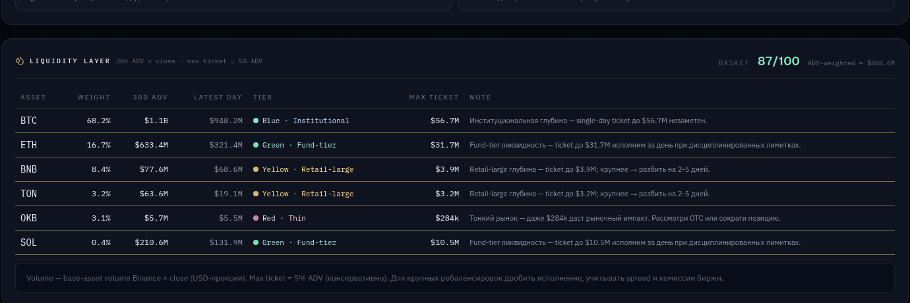

Стратегические «тикеты» от engine:
- «У актива X короткая история — снизить»
- «Cluster Alpha overshoot — урезать»
- «Актив в red liquidity tier — снизить до 2%»
- «BTC+ETH ниже floor — добавить»

### 8.9 Watchlist

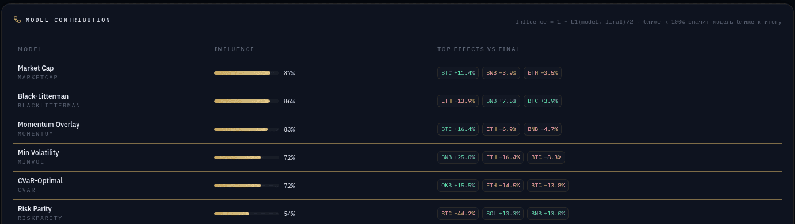

Активы вне портфеля, но под наблюдением:
- **No-data**: история < 90 дней
- **Uncategorized**: не в таксономии
- **Effectively-zero**: в universe, но 0%
- **Honorary**: tracked для контекста (XRP, ADA, AVAX)

### 8.10 Liquidity Layer

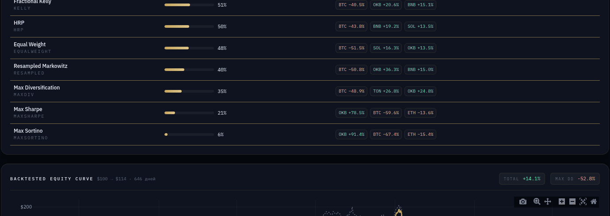

Оценка глубины рынка по каждому активу:

- **Avg daily USD volume** — за 30 дней
- **Tier** — 🔵 blue (≥$1B), 🟢 green ($100M-$1B), 🟡 yellow ($10M-$100M), 🔴 red (<$10M)
- **Max executable ticket** — сколько можно купить (5% от ADV)
- **Basket score 0-100** — оценка корзины в целом

### 8.11 Model Contribution

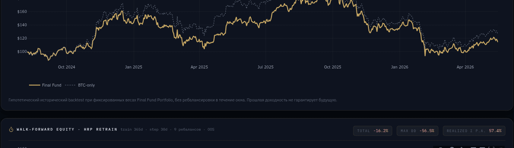

Топ-моделей по влиянию на финальную раскладку. Помогает понять «какая модель победила».

### 8.12 Equity curves

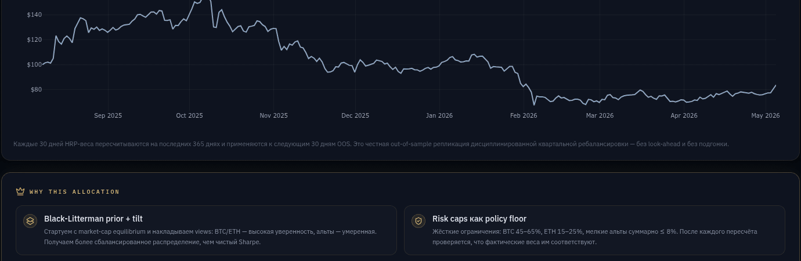

Две кривые:
- **Backtested equity** — что было бы, если держать веса весь период (in-sample)
- **Walk-forward equity** — то же, но с переобучением (out-of-sample, честнее)

### 8.13 «Why this allocation» — 4 reason cards

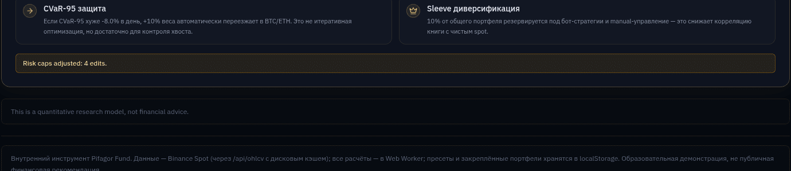

Краткое резюме в 4 пунктах: BL + tilt, caps applied, CVaR defense, model agreement.

### 8.14 Disclaimer

Формальное «это internal research, не публичная рекомендация». На случай аудита.

---

## 9. Вкладка Journal

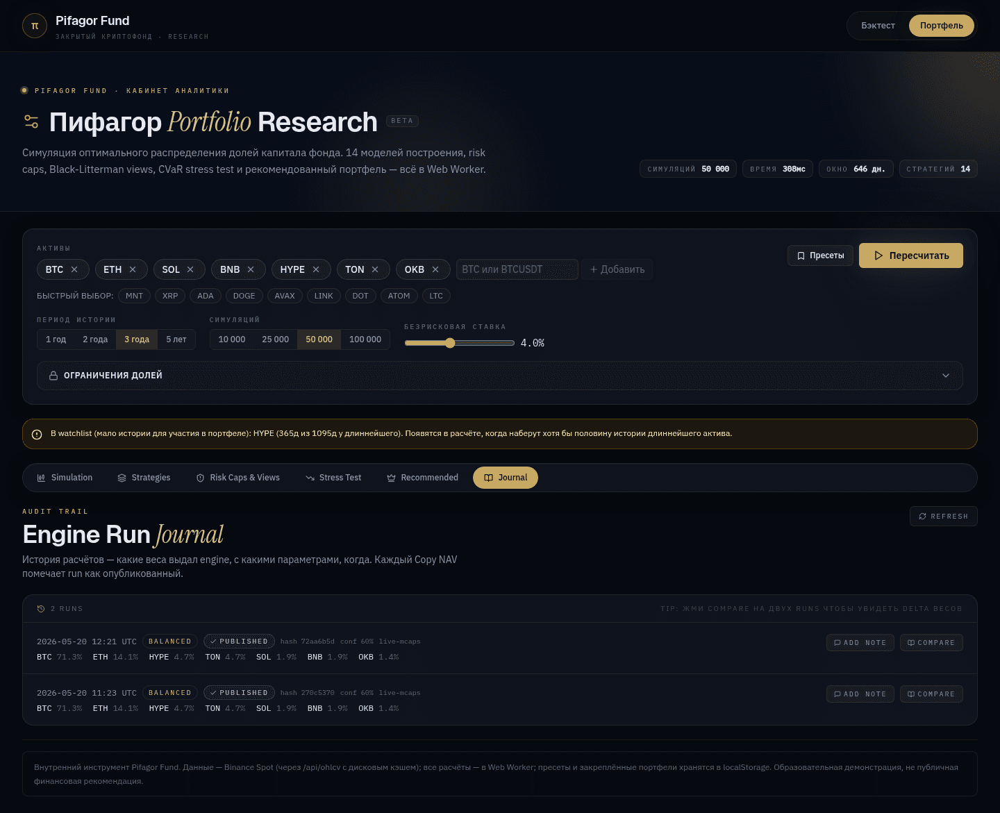

### 9.1 Структура записи

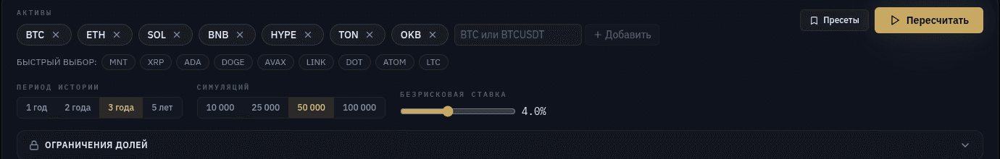

Каждая строка — один расчёт. Поля:

- **Дата + время UTC**
- **Mode badge** — `[BALANCED]` / `[CONSERVATIVE]` / `[AGGRESSIVE]`
- **Published ✓** — нажимал ли Copy NAV
- **hash** — детерминированный SHA-256 параметров
- **conf** — Confidence на момент расчёта
- **`live-mcaps`** — был ли использован live market cap
- **Веса** — все активы ≥ 0.1%

### 9.2 Действия над run'ом

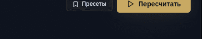

Две кнопки рядом с каждым run'ом:

- **Add note** — inline-комментарий (до 500 символов). Например: «ребаланс после Q1 отчёта».
- **Compare** — выбери два run'а → увидишь diff весов

### 9.3 Compare two runs

Когда выбрал два run'а:

| Symbol | Before | After | Δpp |
|---|---|---|---|
| BTC | 72.0% | 71.3% | −0.7pp |
| ETH | 13.5% | 14.1% | +0.6pp |
| HYPE | 3.0% | 4.7% | +1.7pp |

### 9.4 Refresh

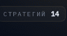

Кнопка справа — подтянуть свежие данные с сервера (если работаешь в нескольких браузерах).

---

## 10. Стоп-сигналы — когда НЕ публиковать NAV

🔴 **Confidence < 40** — серьёзные проблемы с данными или согласием моделей

🔴 **HYPE в Final Fund > 5%** — баг (cap не сработал), репорти разработке

🔴 **Severe drawdown сценарий показывает потерю > 60%** — слишком хрупкая корзина

🔴 **Basket Liquidity score < 50** — корзина непродаваема в нужном объёме

🔴 **Δ vs Live Fund очень большое (>20pp по нескольким позициям)** — лучше делать TWAP несколько дней

🔴 **Walk-forward equity сильно ниже Backtested** — модель переобучена

---

## Готово

После того, как пройдёшь все шаги и нажмёшь **Copy NAV** — JSON в твоём буфере. Открываешь админку Криптофонда → Composition → Submit. Через минуту Δ vs Live Fund покажет 0, инвесторы увидят новую композицию в кабинете.

**В Journal записан run с ✓ published**. Это твой audit trail.

---

## Полезные ссылки

- 📋 Короткая инструкция: [QUICKSTART.md](./QUICKSTART.md)
- 📖 Полный гайд (с финансовой теорией): [USER-GUIDE.md](./USER-GUIDE.md)
- 🌐 Платформа: <https://trading-chart-mvp.onrender.com>
- 🏛 Криптофонд: <https://pifagor.fund>

---

*Документ обновляется по мере развития платформы. Текущая версия: 2026-05-20.*
